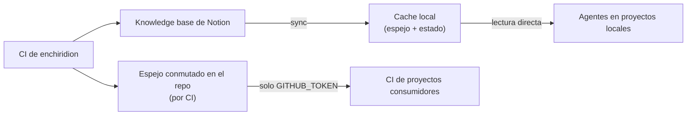

# Arquitectura

Especificación del comportamiento del sistema. Las decisiones de fondo viven en
`ADR.md`; el detalle de implementación pertenece al código.

## Componentes lógicos



- **Comando de sync**: único punto de entrada; actualiza el espejo y el estado.
- **Espejo**: archivos markdown greppables, un archivo por página de la KB.
- **Estado de sincronización**: marca de agua de la última edición sincronizada
  y fecha de la última sync full. Viaja **conmutado junto al espejo** — un cache
  recién clonado incrementa de forma correcta sin re-sincronizar todo.
- **Espejo conmutado en el repo**: copia mantenida por CI para auditoría
  (historial en git) y para consumidores de CI sin credenciales de Notion.

## Modos de sincronización (ADR-07)

El comando elige modo automáticamente; un flag explícito fuerza el modo full.

| Regla de selección | Modo |
|---|---|
| Sin estado previo o espejo vacío | **Full** (auto-backfill: la falta de datos se resuelve sola, sin pasos manuales) |
| La última sync full es más vieja que ~30 días | **Full** |
| Cualquier otro caso | **Incremental** |

- **Full**: sincroniza todas las páginas del data source, limpia los espejos de
  páginas que ya no existen (sweep) y reinicia la marca de agua. Es el único
  modo que propaga borrados (~mensual, aceptado en ADR-04).
- **Incremental**: sincroniza solo las páginas editadas desde la marca de agua,
  con un margen de solape que absorbe diferencias de reloj. No hace sweep.

**Consistencia de identidad**: si el título de una página editada cambia, el
archivo existente se actualiza in-place (identificación por `notion_id` en el
frontmatter) — nunca quedan duplicados entre fulls.

**Exclusividad**: una corrida de sync adquiere acceso exclusivo al cache; una
segunda invocación simultánea falla rápido con mensaje claro. Sin lock, un cron
mensual y un sync local simultáneos podrían corromper el estado.

## Formato del espejo (contrato observable)

Nombre de archivo: `{slug}--{id8}.md` — slug kebab-case sin acentos del título +
prefijo corto del `notion_id`.

```markdown
---
title: "El desafío del lenguaje ubicuo en español"
tags: ["articulo", "ddd", "lenguaje-ubicuo"]
source_url: https://fuente-original.com/post
notion_id: a1b2c3d4-e5f6-7890-abcd-ef0123456789
notion_url: https://notion.so/a1b2c3d4e5f6...
last_edited: 2026-09-20T10:00:00.000Z
---

<cuerpo de la página, renderizado a markdown>
```

- Un `.md` por página; el espejo completo es greppable sin ninguna herramienta
  más que las estándar del sistema.
- `tags` incluye la categoría y todos los temas de la página (incluidas las
  clasificaciones dinámicas del curador automático). El filtrado por tema es
  responsabilidad del lector.
- `source_url` solo está presente si la página referencia una fuente externa.

## Contrato de renderizado (ADR-05)

Regla cardinal: **ninguna pérdida de contenido puede pasar inadvertida** — todo
bloque que no pueda renderizarse queda como comentario visible en el markdown.

| Bloque | Markdown |
|---|---|
| Párrafos, headings (3 niveles), listas (viñetas y numeradas), quotes | su equivalente directo |
| Callouts | como quote |
| Código | bloque fenced con su lenguaje |
| Divisor | `---` |
| Enlaces guardados (bookmark, embed, preview) | link al recurso |
| Imágenes externas | imagen markdown con su URL |
| Imágenes internas de Notion | comentario visible explicando que no se preservan (su URL expira; decisión en ADR-05) |
| Toggles | texto destacado (su contenido oculto no se descarga) |
| Sub-páginas | comentario visible con el título |
| Tablas | tabla markdown, con fila de encabezado cuando la tabla la declara |
| Cualquier otro bloque | comentario visible `<!-- unsupported block: X -->` |

Formato inline: negrita, itálica, tachado, código y enlaces según el texto
original.

## Comportamiento ante errores

| Situación | Comportamiento observable |
|---|---|
| Configuración faltante o inválida | mensaje claro, sin intento de contacto con la API, código de salida de error |
| Credenciales rechazadas | fallo explícito e inmediato con mensaje orientado a la solución — nunca un fallback silencioso |
| Límite de tasa o error transitorio de la API | reintento con espera, respetando las señales de la API |
| Fallo al sincronizar una página | se registra, continúa con el resto |
| Fin de corrida con fallos parciales | código de salida de error + resumen (`X de N fallaron`) |

## Requisitos no funcionales

- **Cero dependencias de terceros** (ADR-08): toda la cadena de red y parseo es
  auditable en el propio repo.
- Sync incremental imperceptible para una KB de ~1000 entradas (< 1 min); sync
  full tolerable como job nocturno (presupuesto de requests en integration.md).
- **Toda la lógica es testeable sin red** — la única verificación que requiere
  credenciales reales es el smoke contra la API viva.
