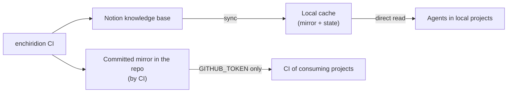

# Architecture

Specification of system behavior. Substantive decisions live in `ADR.md`;
implementation detail belongs in the code.

## Logical components



- **Sync command**: single entry point; updates the mirror and the state.
- **Mirror**: greppable markdown files, one file per KB page.
- **Sync state**: watermark of the last synchronized edit and the date of the
  last full sync. It travels **committed alongside the mirror** — a freshly
  cloned cache increments correctly without re-syncing everything.
- **Committed mirror in the repo**: copy maintained by CI for auditability
  (history in git) and for CI consumers without Notion credentials.

## Sync modes (ADR-07)

The command chooses the mode automatically; an explicit flag forces full mode.

| Selection rule | Mode |
|---|---|
| No prior state or empty mirror | **Full** (auto-backfill: missing data resolves itself, no manual steps) |
| Last full sync older than ~30 days | **Full** |
| Any other case | **Incremental** |

- **Full**: synchronizes all pages of the data source, cleans the mirrors of
  pages that no longer exist (sweep) and resets the watermark. It is the only
  mode that propagates deletions (~monthly, accepted in ADR-04).
- **Incremental**: synchronizes only the pages edited since the watermark,
  with an overlap margin that absorbs clock drift. It performs no sweep.

**Identity consistency**: if the title of an edited page changes, the existing
file is updated in-place (identified by `notion_id` in the frontmatter) —
duplicates never accumulate between full syncs.

**Exclusivity**: a sync run acquires exclusive access to the cache; a second
simultaneous invocation fails fast with a clear message. Without a lock, a
monthly cron and a local sync running concurrently could corrupt the state.

## Mirror format (observable contract)

File name: `{slug}--{id8}.md` — kebab-case slug without accents from the title +
short prefix of the `notion_id`.

```markdown
---
title: "The challenge of the ubiquitous language in Spanish"
tags: ["article", "ddd", "ubiquitous-language"]
source_url: https://original-source.com/post
notion_id: a1b2c3d4-e5f6-7890-abcd-ef0123456789
notion_url: https://notion.so/a1b2c3d4e5f6...
last_edited: 2026-09-20T10:00:00.000Z
---

<page body, rendered to markdown>
```

- One `.md` per page; the whole mirror is greppable with no tool beyond the
  system's standard ones.
- `tags` includes the category and all topics of the page (including dynamic
  classifications from the automatic curator). Filtering by topic is the
  reader's responsibility.
- `source_url` is only present if the page references an external source.

## Rendering contract (ADR-05)

Cardinal rule: **no content loss may go unnoticed** — every block that cannot
be rendered is left as a visible comment in the markdown.

| Block | Markdown |
|---|---|
| Paragraphs, headings (3 levels), lists (bulleted and numbered), quotes | their direct equivalent |
| Callouts | as a quote |
| Code | fenced block with its language |
| Divider | `---` |
| Saved links (bookmark, embed, preview) | link to the resource |
| External images | markdown image with its URL |
| Notion-internal images | visible comment explaining that they are not preserved (their URL expires; decision in ADR-05) |
| Toggles | highlighted text (their hidden content is not downloaded) |
| Sub-pages | visible comment with the title |
| Tables | markdown table, with a header row when the table declares one |
| Any other block | visible comment `<!-- unsupported block: X -->` |

Known-type blocks that arrive without their expected payload (a link with no
URL, an image with no source) also render a visible marker — never an empty or
silent output.

Inline formatting: bold, italic, strikethrough, code, and links according to the
original text.

## Error behavior

| Situation | Observable behavior |
|---|---|
| Missing or invalid configuration | clear message, no attempt to contact the API, error exit code |
| Rejected credentials | explicit and immediate failure with a solution-oriented message — never a silent fallback |
| Rate limit or transient API error | retry with backoff, respecting the API's signals |
| Failure to synchronize a page | it is logged, the rest continues |
| Run ends with partial failures | error exit code + summary (`X of N failed`) |

## Non-functional requirements

- **Zero third-party dependencies** (ADR-08): the entire networking and parsing
  chain is auditable in the repo itself.
- Incremental sync imperceptible for a KB of ~1000 entries (< 1 min); full sync
  tolerable as a nightly job (request budget in integration.md).
- **All logic is testable without network** — the only verification that
  requires real credentials is the smoke test against the live API.
