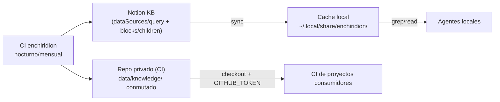

# Arquitectura

Stack: **Go stdlib-only** (ADR-08) — `net/http`, `encoding/json`, sin dependencias
externas. Binario estático único.

## Componentes



## Layout del repo

```
enchiridion/
  cmd/enchiridion/main.go     # CLI: flag --full, exit codes, logging
  internal/notion/            # cliente HTTP stdlib: query, blocks, retry/backoff
  internal/notion/*_test.go   # fixtures JSON + httptest
  internal/render/            # blocks -> markdown (puro)
  internal/render/*_test.go   # golden tests offline
  internal/sync/              # modos, watermark, sweep, rename-safe write
  internal/sync/*_test.go     # temp dirs + httptest
  data/                       # espejo conmutado por CI (solo en este repo)
  specs/ · ADR.md
```

El scaffold JS (commit `378a521`) se elimina en la fase 0 (ADR-08).

## Directorios en runtime

| Variable | Default | Contenido |
|---|---|---|
| `ENCHIRIDION_HOME` | `~/.local/share/enchiridion` | raíz del cache |
| — | `$ENCHIRIDION_HOME/knowledge/` | espejo: un `.md` por página |
| — | `$ENCHIRIDION_HOME/.sync-state.json` | watermark y última sync full |

`.sync-state.json` se conmuta junto al espejo (commiteado): un clone/cache fresco
incrementa correcto.

```json
{ "last_full_at": "2026-09-20T09:00:00Z", "watermark": "2026-09-20T14:32:11Z" }
```

## Modos de sync (ADR-07)

Algoritmo de selección (flag `--full` fuerza full):

```
sin .sync-state.json o knowledge/ vacío   -> full   (auto-backfill, ADR-07)
now - last_full_at > 30 días              -> full
otro caso                                 -> incremental
```

**Full**: paginar *todas* las páginas del data source (`page_size` 100) →
descargar bloques de cada una → escribir `.md` → **sweep** de espejos sin página
vigente → reset watermark. Correcciones de borrados solo acá (~mensual).

**Incremental**: query con filtro
`{"timestamp": "last_edited_time", "last_edited_time": {"on_or_after": watermark - 60s}}`
(margen anti clock-skew) → reescribir solo esas páginas → avanzar watermark.
Sin sweep: los borrados quedan hasta el próximo full (aceptado: ADR-04).

**Rename-safe write**: antes de escribir, escanear `knowledge/*.md` por
`notion_id:` en frontmatter; si existe archivo con ese id, reescribir *ese path*
(aunque el slug del título haya cambiado). Cero duplicados entre fulls.

## Formato del espejo (ADR-03)

Nombre: `{slug}--{id8}.md` — slug kebab-case sin acentos del título + primeros 8
caracteres del `notion_id`.

```markdown
---
title: "El desafío del lenguaje ubicuo en español"
tags: ["articulo", "ddd", "lenguaje-ubicuo"]
source_url: https://fuente-original.com/post
notion_id: a1b2c3d4-e5f6-7890-abcd-ef0123456789
notion_url: https://notion.so/a1b2c3d4e5f6...
last_edited: 2026-09-20T10:00:00.000Z
---

<cuerpo renderizado>
```

- `tags`: `Category` (multi_select) + todas las selects/multi_selects/status
  presentes; valores únicos, orden de llegada. El mapeo de propiedades reales
  está en integration.md.
- `source_url` solo si la página tiene `URL`; escapado de `"` en strings YAML.

## Contrato del renderer (ADR-05)

Flat: sin recursión de bloques hijos, **excepto tablas** (celdas vía
`table_row`). Todo tipo no listado produce marcador visible
`<!-- unsupported block: X -->`.

| Bloque Notion | Markdown |
|---|---|
| `paragraph` | texto inline |
| `heading_1/2/3` | `#`/`##`/`###` |
| `bulleted_list_item` | `- ` |
| `numbered_list_item` | `1.` `2.` … (contador propio, resetea con otro bloque) |
| `quote`, `callout` | `> ` |
| `code` | fenced, con language |
| `divider` | `---` |
| `bookmark`, `embed`, `link_preview` | `[url](url)` |
| `image` | external → ``; internal (file) → `<!-- imagen interna de Notion: expira; no se descarga (ADR-05) -->` |
| `toggle` | `**texto**` (hijos no se descargan) |
| `child_page` | `<!-- child page: {title} -->` |
| `table` | tabla markdown: header de fila 1 si `has_column_header`; celdas con `\|` escapado y newlines → `<br>`; filas vía fetch de children (`table_row.cells`) |
| otros | `<!-- unsupported block: X -->` |

Inline (`rich_text`): `code` → backticks, luego `bold` → `**`, `italic` → `_`,
`strikethrough` → `~~`, `href` → `[texto](href)`.

## Errores y códigos de salida

| Situación | Comportamiento |
|---|---|
| Env faltante (token / datasource id) | mensaje claro, exit 1, sin llamar a la API |
| HTTP 401/403 | fail-fast con mensaje explícito de credenciales — sin fallback silencioso |
| HTTP 429 | respetar `Retry-After`, backoff exponencial, reintento |
| 5xx / red | retry con backoff (máx. 3 por request) |
| Fallo por página (bloques, etc.) | log a stderr, continuar con las demás |
| Fin de corrida con fallos | exit 1 y reporte `X de N páginas fallaron` (patrón organizer) |

## Testing

- **Offline por diseño**: `internal/render` puro (golden tests de la tabla de
  bloques); `internal/notion` con `httptest` + fixtures JSON capturados;
  `internal/sync` con directorios temporales (`t.TempDir()`).
- Suite obligatoria verde: `go test ./... && go vet ./...`.
- **Smoke real** (no automatizable sin secret): primera corrida contra la API
  viva con token propio; luego el workflow de CI la ejercita.
- La lógica de selección de modo, sweep y rename es la de mayor riesgo → tests
  obligatorios por tabla de casos.
